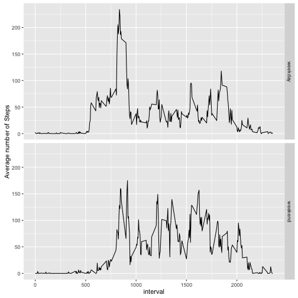

### Code for reading in the dataset and/or processing the data

```r
if(!file.exists('activity.csv')){
  unzip('activity.zip')
}

activity <- read.csv('activity.csv', header = TRUE)
```
### Histogram of the total number of steps taken each day

```r
library(knitr)
library(dplyr)
activity1 <- subset(activity, complete.cases(activity)) # remove NAs
activity2 <- subset(activity, complete.cases(activity))

library(data.table)

activity1 <- as.data.table(activity1)

# create a new dataframe with the sum of steps per day
activity1 <- activity1[, list(steps_day= sum(steps)), by=date] 
```

```r
library(ggplot2)

# I first obtain the barplot that represents the total steps made per day
ggplot(activity1, aes(x=date, y=steps_day)) + geom_bar(stat = "identity") +
  theme(axis.text.x=element_text(angle=45, hjust=1, size = 6))+ ## to rotate the x axis labels 90 degrees
  ggtitle("total steps taken each day")
```


```r
# And now the histogram representing the frequencies of total steps per day
q <- ggplot(activity1, aes(x=steps_day)) + geom_histogram(binwidth = 500)
  q <- q + xlab ("total steps per day")
    q <- q + ggtitle("total steps per day frequencies")
  print(q)
```


### Mean and median number of steps taken each day

```r
 c(mean(activity1$steps_day), median(activity1$steps_day))
```

```
## [1] 10766.19 10765.00
```
### Time series plot of the average number of steps taken

```r
averages <- aggregate(x=list(steps=activity$steps), by=list(interval=activity$interval),
                      FUN=mean, na.rm=TRUE)
ggplot(data=averages, aes(x=interval, y=steps)) +
  geom_line() +
  xlab("5-minute interval") +
  ylab("average number of steps taken")
```


### The 5-minute interval that, on average, contains the maximum number of steps

```r
averages[which.max(averages$steps),]
```

```
##     interval    steps
## 104      835 206.1698
```
### Code to describe and show a strategy for imputing missing data

```r
# how many NAs

missing_values <- is.na(averages$steps)

table(missing_values)
```

```
## missing_values
## FALSE 
##   288
```

```r
# Fill NA values with the average of its corresponding interval
imputed <- activity
imputed [ missing_values, "steps" ] <-rep(averages$steps, length.out = nrow(imputed))[missing_values]
```
### Histogram of the total number of steps taken each day after missing values are imputed

```r
daily_imputed <- aggregate(steps ~ date, data = imputed, FUN = sum)
qplot(steps, data = daily_imputed, binwidth = 500)
```


### Panel plot comparing the average number of steps taken per 5-minute interval across weekdays and weekends

```r
activity2$date <- as.Date(activity2$date, "%Y-%m-%d")
activity2$weekend <- "weekday"
activity2$weekend[weekdays(activity2$date) %in% c("Saturday","Sunday")] <- "weekend"
activity2$weekend <- as.factor(activity2$weekend)

wewd <- activity2 %>% 
  group_by(interval, weekend) %>% 
  summarize(avgsteps = mean(steps))
qplot(x = interval, y = avgsteps, data = wewd, geom = c("line"), 
      facets = weekend~., ylab = "Average number of Steps")
```




